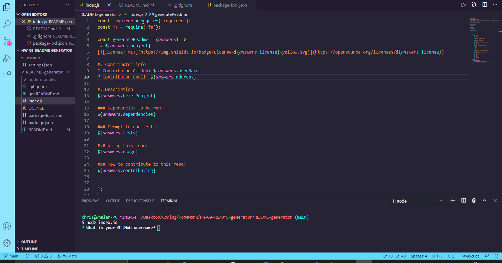

# Updated Portfolio

## Contributers
* Chris Whalen, Github: **[CobaltFrostfish](https://github.com/CobaltFrostfish)**

## Links
* **[Repository](https://github.com/CobaltFrostfish/README-generator)**
# 

## The project
Having a solid README as a developer is like icing on the cake to a great project. The README describes what your project is, who contributed to it, and any further details that a user or client may need to know. This project is a README generator and places the control of devolping a solid README easily within your hands. So go ahead, run the program, follow the prompts, and build a solid README.

## Technologies applied
* JavaScript
* NodeJS

## The final production:
